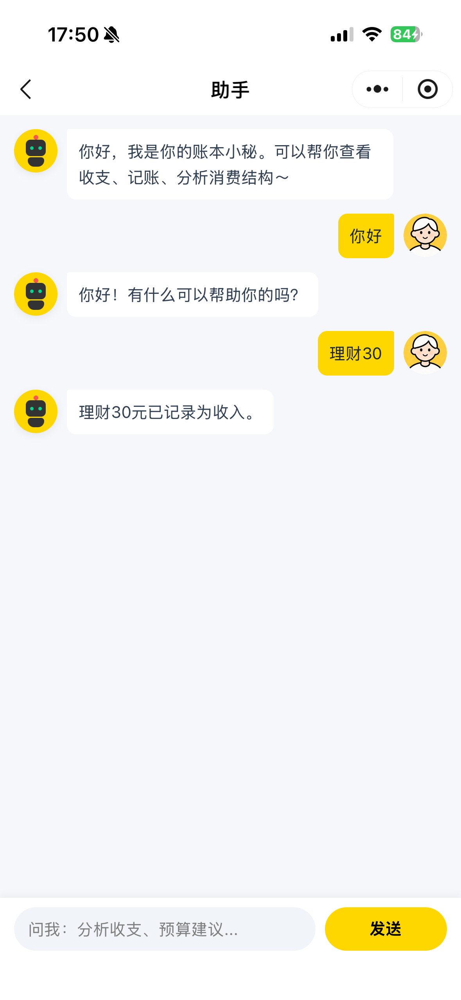
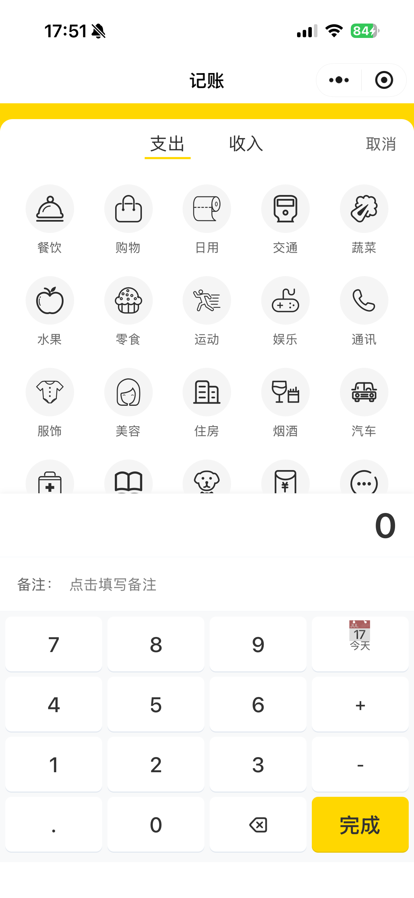
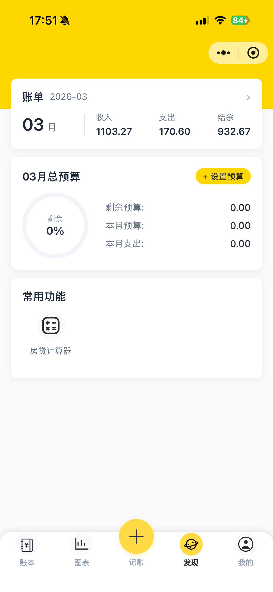
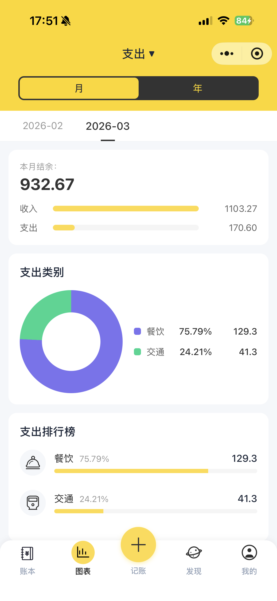
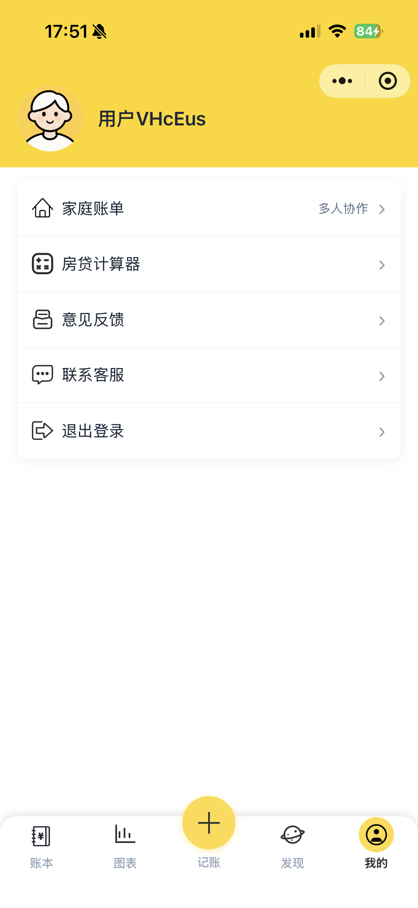
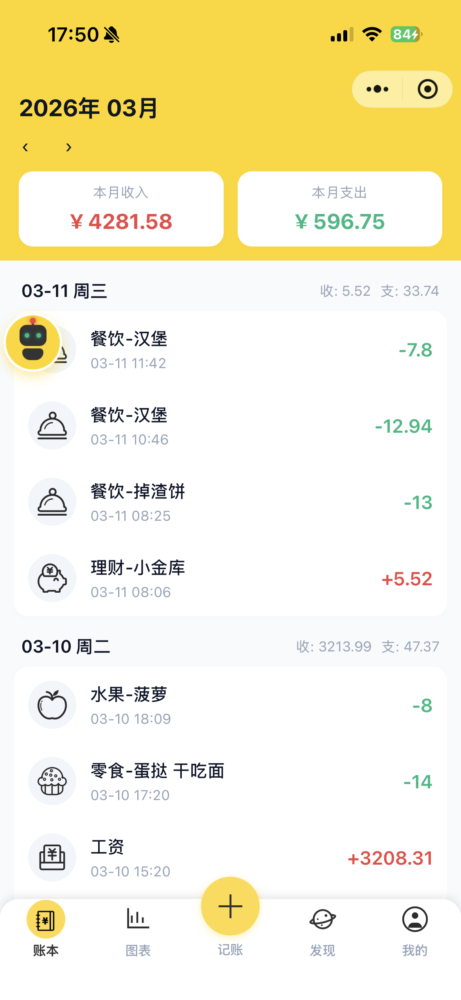
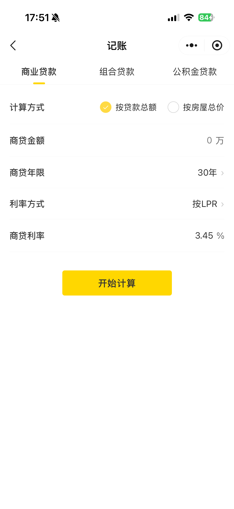

# Billing Java

A home accounting and financial management system based on Spring Boot, supporting bill recording, budget management, AI intelligent assistant, and family sharing features.

## Project Overview

Billing Java is a complete backend service for home financial management, designed with a microservices architecture and providing RESTful API interfaces. The system supports multi-user family bill sharing, income and expense analysis, budget setting, and integrates large AI models for intelligent bookkeeping and financial analysis.

## Online Demo


## Related Repositories

- **Backend**: This repository
- **WeChat Mini Program**: [https://gitee.com/zhang-lichao/billing_mini.git](https://gitee.com/zhang-lichao/billing_mini.git)

## Technology Stack

- **Framework**: Spring Boot 3.x
- **Database**: MySQL + MyBatis-Plus
- **Cache**: Redis
- **Security**: Spring Security + JWT
- **AI**: LangChain4j (Qwen)
- **Build Tool**: Maven

## Core Features

### Bill Management
- Record daily income and expenses
- Query bills by time dimension
- Edit and delete bills
- Category management (dining, salary, transportation, etc.)
- Monthly/annual bill statistics
- Income and expense ranking lists

### Budget Management
- Set monthly budgets
- Query budget execution status

### Family Sharing
- Manage family members
- Join or leave a family
- Modify member remarks
- Share family ledger

### AI Intelligent Assistant
- Natural language bookkeeping
- Intelligent category matching
- Monthly income and expense analysis
- Streamed conversational interaction

### System Management
- User authentication and authorization (JWT)
- Role-based permission management
- Menu management
- Operation logs
- API rate limiting
- Data encryption transmission (RSA)

## UI Preview

<table>
  <tr>
    <td align="center">
      
      <br/>AI Assistant
    </td>
    <td align="center">
      
      <br/>Category
    </td>
  </tr>
  <tr>
    <td align="center">
      
      <br/>Discovery
    </td>
    <td align="center">
      
      <br/>Analysis Chart
    </td>
  </tr>
  <tr>
    <td align="center">
      
      <br/>Profile
    </td>
    <td align="center">
      
      <br/>Bookkeeping
    </td>
  </tr>
  <tr>
    <td align="center">
      
      <br/>Bill
    </td>
    <td align="center">
      
      <br/>Loan Calculator
    </td>
  </tr>
</table>

## Project Structure

```
src/main/java/com/fq/
├── ability/               # Common capability components
│   ├── anno/             # Custom annotations (@Log, @RequestLimit)
│   ├── aspect/           # AOP aspects (logging, rate limiting)
│   ├── encrypt/          # RSA encryption service
│   ├── jwt/              # JWT utility classes
│   ├── mybatis/          # MyBatis interceptors (auto-fill, data permissions)
│   └── redis/            # Redis service
├── api/                  # API base components
│   ├── api/              # Unified response packaging
│   ├── dto/              # Common DTOs
│   ├── enums/            # Common enums
│   └── exception/        # Exception handling
├── config/               # Configuration classes
├── modules/              # Business modules
│   ├── ai/               # AI assistant module
│   ├── budget/           # Budget module
│   ├── captcha/          # CAPTCHA module
│   ├── category/         # Category module
│   ├── chat/             # Chat history module
│   ├── family/           # Family management module
│   ├── feedback/         # Feedback module
│   ├── record/           # Bill record module
│   ├── sys/              # System management module (users, roles, menus, logs)
│   ├── third/            # Third-party services (WeChat)
│   └── upload/           # File upload module
├── security/             # Security authentication module
└── utils/                # Utility classes
```

## Quick Start

### Environment Requirements

- JDK 21+
- Maven 3.8+
- MySQL 8.0+
- Redis 6.0+

### Configuration Details

Main configuration files are located in `src/main/resources/`:

- `application.yml` - Main configuration file
- `application-dev.yml` - Development environment configuration
- `application-prod.yml` - Production environment configuration

Required configurations:

```yaml
spring:
  datasource:
    url: jdbc:mysql://localhost:3306/billing
    username: root
    password: your_password
  data:
    redis:
      host: localhost
      port: 6379

# JWT configuration
jwt:
  expire-time: 86400
  secret: your_secret_key

# Encryption configuration
encrypt:
  public-key: your_public_key
  private-key: your_private_key

# WeChat configuration
wechat:
  wmp:
    appId: your_app_id
    appSecret: your_app_secret

# File upload configuration
file:
  upload:
    path: /uploads
  web:
    url: http://localhost:8080
```

### Database Initialization

Execute the SQL script to create the database and tables:

```bash
mysql -u root -p < src/main/resources/sql/billing.sql
```

### Build and Run

```bash
# Package
./mvnw clean package -DskipTests

# Run
java -jar target/*.jar
```

### Docker Deployment

```bash
docker build -t billing-java .
docker run -d -p 9527:9527 billing-java
```

## API Overview

### Public APIs

| Endpoint | Method | Description |
|----------|--------|-------------|
| `/api/common/captcha/gen` | GET | Generate CAPTCHA |
| `/api/common/file/upload` | POST | File upload |
| `/api/common/ai/chat` | GET | AI intelligent conversation |

### Frontend APIs

| Endpoint | Method | Description |
|----------|--------|-------------|
| `/api/front/user/login` | POST | WeChat login |
| `/api/front/record/*` | GET/POST/DELETE | Bill management |
| `/api/front/budget/*` | GET/POST | Budget management |
| `/api/front/category/listByCategoryType` | GET | Category list |
| `/api/front/family/*` | GET/POST/DELETE | Family management |
| `/api/front/chat/list` | GET | Chat history |

### Admin APIs

| Endpoint | Method | Description |
|----------|--------|-------------|
| `/api/admin/sys/user/login` | POST | User login |
| `/api/admin/sys/role/*` | GET/POST/DELETE | Role management |
| `/api/admin/sys/menu/*` | GET/POST/DELETE | Menu management |
| `/api/admin/sys/log/paging` | GET | Log query |

## Core Feature Highlights

### 1. Automatic Data Filling
Uses MyBatis interceptors to automatically populate fields such as creation time, update time, creator, and modifier.

### 2. Data Permission Control
Implements role-based data permission filtering, supporting data isolation by department or role.

### 3. API Rate Limiting
Uses custom annotation `@RequestLimit` to implement interface anti-brute-force rate limiting.

### 4. Operation Logging
Automatically records API call logs using the `@Log` annotation.

### 5. RSA Encrypted Transmission
Sensitive data (e.g., passwords) are encrypted using RSA public key before transmission to ensure security.

### 6. AI Intelligent Bookkeeping
Integrates the Qwen large model to support natural language bookkeeping and intelligent financial analysis.

## License

This project is intended solely for learning and communication purposes.

## Contact Me

<div align="center">
  
  <br/>
  <p>Scan the QR code above to add me as a friend.</p>
</div>