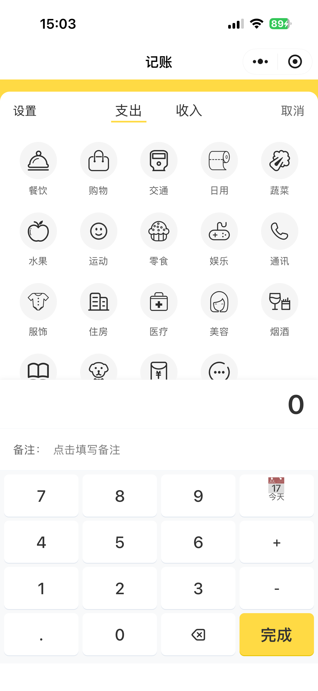
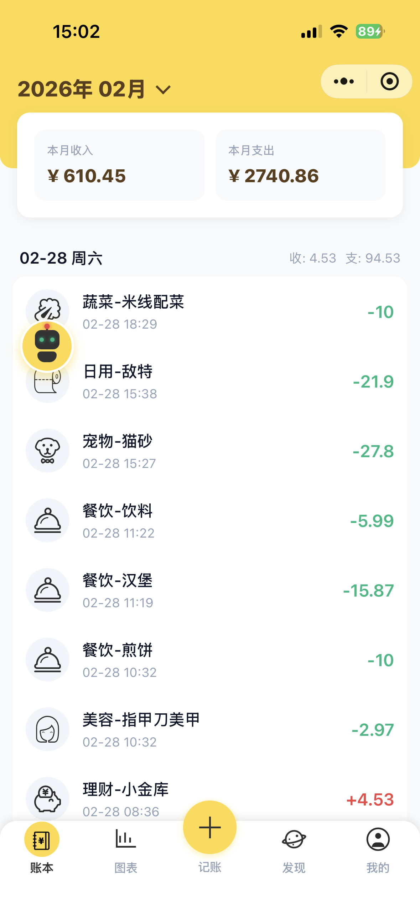
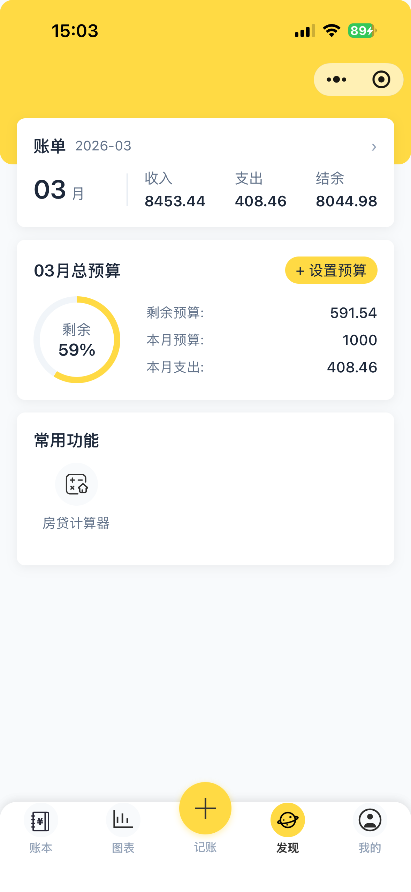
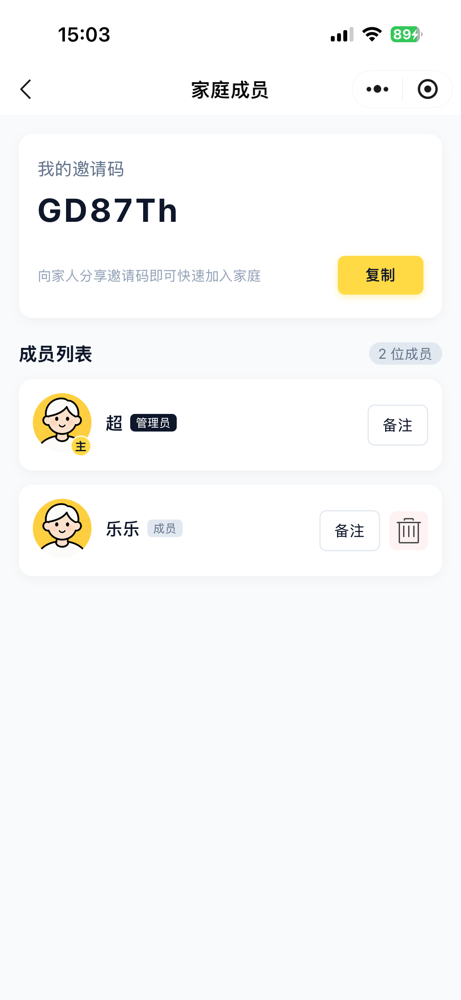
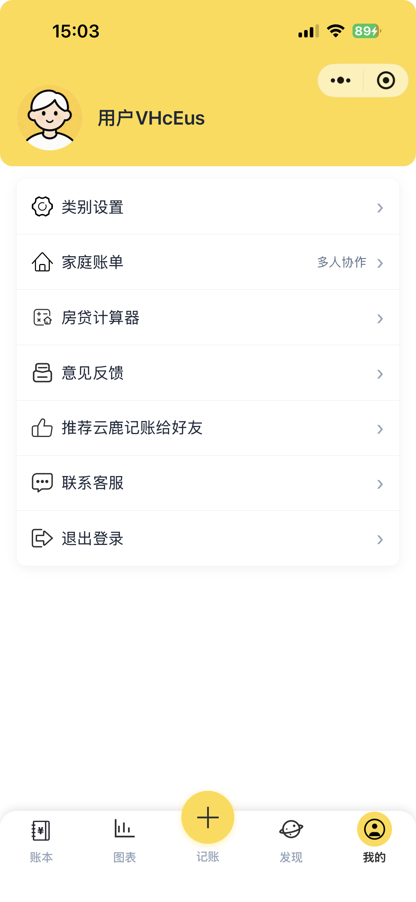
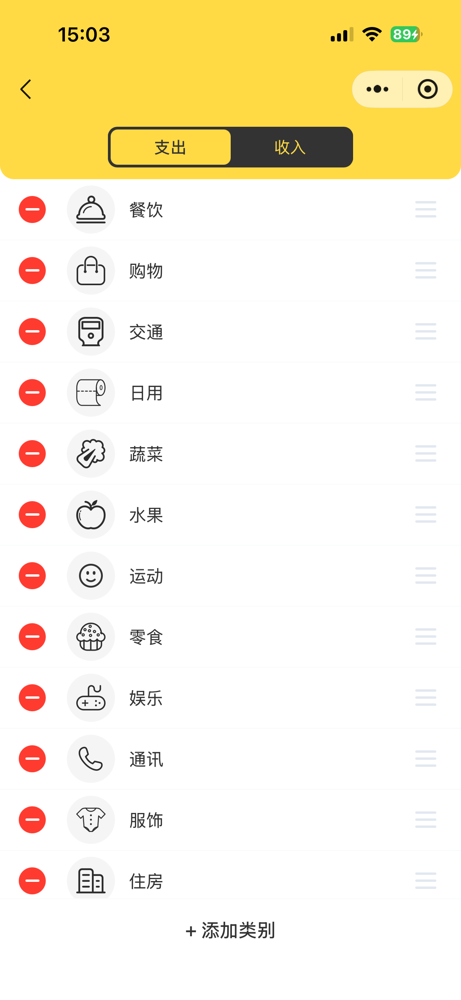
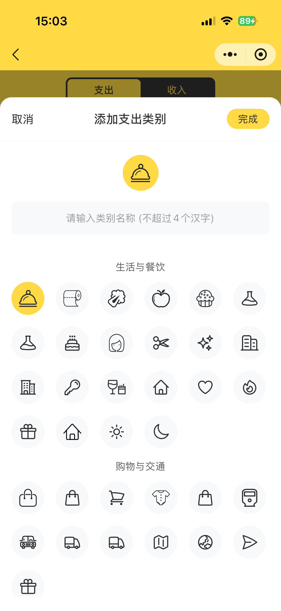

# Billing Java

一个基于 Spring Boot 的家庭记账理财系统，支持账单记录、预算管理、AI 智能助手、家庭共享等功能。

## 项目简介

Billing Java 是一个完整的家庭财务管理后端服务，采用微服务架构设计，提供 RESTful API 接口。系统支持多用户家庭共享记账、收支分析、预算设置等功能，并集成了 AI 大模型实现智能记账和财务分析。

## 在线体验


## 相关仓库

- **后端代码**: 当前仓库
- **微信小程序**: [https://github.com/chao69782/billing_mini.git](https://github.com/chao69782/billing_mini.git)

## 技术栈

- **框架**: Spring Boot 3.x
- **数据库**: MySQL + MyBatis-Plus
- **缓存**: Redis
- **安全**: Spring Security + JWT
- **AI**: LangChain4j (通义千问)
- **构建工具**: Maven

## 核心功能

### 账单管理
- 记录日常收支（收入/支出）
- 按时间维度查询账单
- 账单编辑与删除
- 分类管理（餐饮、工资、交通等）
- 月度/年度账单统计
- 收支排行榜

### 预算管理
- 月度预算设置
- 预算执行情况查询

### 家庭共享
- 家庭成员管理
- 加入/退出家庭
- 成员备注修改
- 家庭账本共享

### AI智能助手
- 自然语言记账
- 智能分类匹配
- 月度收支分析
- 流式对话交互

### 系统管理
- 用户认证与授权（JWT）
- 角色权限管理
- 菜单管理
- 操作日志
- 接口限流
- 数据加密传输（RSA）

## 界面预览

<table>
  <tr>
    <td align="center">
      
      <br/>Bookkeeping
    </td>
    <td align="center">
      
      <br/>Record List
    </td>
    <td align="center">
      
      <br/>Balance Summary
    </td>
  </tr>
  <tr>
    <td align="center">
      
      <br/>Chart Statistics 1
    </td>
    <td align="center">
      
      <br/>Chart Statistics 2
    </td>
    <td align="center">
      
      <br/>Discovery
    </td>
  </tr>
  <tr>
    <td align="center">
      
      <br/>AI Assistant
    </td>
    <td align="center">
      
      <br/>Family Bookkeeping
    </td>
    <td align="center">
      
      <br/>Profile
    </td>
  </tr>
  <tr>
    <td align="center">
      
      <br/>Category Settings
    </td>
    <td align="center">
      
      <br/>Custom Category
    </td>
    <td align="center">
    </td>
  </tr>
</table>

## 项目结构

```
src/main/java/com/fq/
├── ability/               # 公共能力组件
│   ├── anno/             # 自定义注解（@Log, @RequestLimit）
│   ├── aspect/           # AOP切面（日志、限流）
│   ├── encrypt/          # RSA加密服务
│   ├── jwt/              # JWT工具类
│   ├── mybatis/          # MyBatis拦截器（自动填充、数据权限）
│   └── redis/            # Redis服务
├── api/                  # API基础组件
│   ├── api/              # 统一响应封装
│   ├── dto/              # 公共DTO
│   ├── enums/            # 公共枚举
│   └── exception/        # 异常处理
├── config/               # 配置类
├── modules/              # 业务模块
│   ├── ai/               # AI助手模块
│   ├── budget/           # 预算模块
│   ├── captcha/          # 验证码模块
│   ├── category/         # 分类模块
│   ├── chat/             # 聊天记录模块
│   ├── family/           # 家庭管理模块
│   ├── feedback/         # 反馈模块
│   ├── record/           # 账单记录模块
│   ├── sys/              # 系统管理模块（用户、角色、菜单、日志）
│   ├── third/            # 第三方服务（微信）
│   └── upload/           # 文件上传模块
├── security/             # 安全认证模块
└── utils/                # 工具类
```

## 快速开始

### 环境要求

- JDK 21+
- Maven 3.8+
- MySQL 8.0+
- Redis 6.0+

### 配置说明

主要配置文件位于 `src/main/resources/`：

- `application.yml` - 主配置文件
- `application-dev.yml` - 开发环境配置
- `application-prod.yml` - 生产环境配置

必需配置项：

```yaml
spring:
  datasource:
    url: jdbc:mysql://localhost:3306/billing
    username: root
    password: your_password
  data:
    redis:
      host: localhost
      port: 6379

# JWT配置
jwt:
  expire-time: 86400
  secret: your_secret_key

# 加密配置
encrypt:
  public-key: your_public_key
  private-key: your_private_key

# 微信配置
wechat:
  wmp:
    appId: your_app_id
    appSecret: your_app_secret

# 文件上传配置
file:
  upload:
    path: /uploads
  web:
    url: /file/**
```

### 数据库初始化

执行 SQL 脚本创建数据库和表：

```bash
mysql -u root -p < src/main/resources/sql/billing.sql
```

### 构建运行

```bash
# 打包
./mvnw clean package -DskipTests

# 运行
java -jar target/*.jar
```

### Docker 部署

```bash
docker build -t billing-java .
docker run -d -p 9527:9527 billing-java
```

## API 接口概览

### 公共接口

| 接口 | 方法 | 描述 |
|------|------|------|
| `/api/common/captcha/gen` | GET | 生成图形验证码 |
| `/api/common/file/upload` | POST | 文件上传 |
| `/api/common/ai/chat` | GET | AI智能对话 |

### 前端接口

| 接口 | 方法 | 描述 |
|------|------|------|
| `/api/front/user/login` | POST | 微信登录 |
| `/api/front/record/*` | GET/POST/DELETE | 账单管理 |
| `/api/front/budget/*` | GET/POST | 预算管理 |
| `/api/front/category/listByCategoryType` | GET | 分类列表 |
| `/api/front/family/*` | GET/POST/DELETE | 家庭管理 |
| `/api/front/chat/list` | GET | 聊天记录 |

### 后台管理接口

| 接口 | 方法 | 描述 |
|------|------|------|
| `/api/admin/sys/user/login` | POST | 用户登录 |
| `/api/admin/sys/role/*` | GET/POST/DELETE | 角色管理 |
| `/api/admin/sys/menu/*` | GET/POST/DELETE | 菜单管理 |
| `/api/admin/sys/log/paging` | GET | 日志查询 |

## 核心特性说明

### 1. 数据自动填充
使用 MyBatis 拦截器自动填充创建时间、更新时间、创建人、修改人等字段。

### 2. 数据权限控制
实现了基于用户角色的数据权限过滤，支持按部门/角色隔离数据。

### 3. 接口限流
使用自定义注解 `@RequestLimit` 实现接口防刷限流。

### 4. 操作日志
使用 `@Log` 注解自动记录接口调用日志。

### 5. RSA 加密传输
敏感数据（如密码）使用 RSA 公钥加密传输，确保安全性。

### 6. AI 智能记账
集成通义千问大模型，支持自然语言记账和智能财务分析。

## License

本项目仅供学习交流使用。

## 联系我

<div align="center">
  
  <br/>
  <p>扫一扫上面的二维码图案，加我为朋友。</p>
</div>